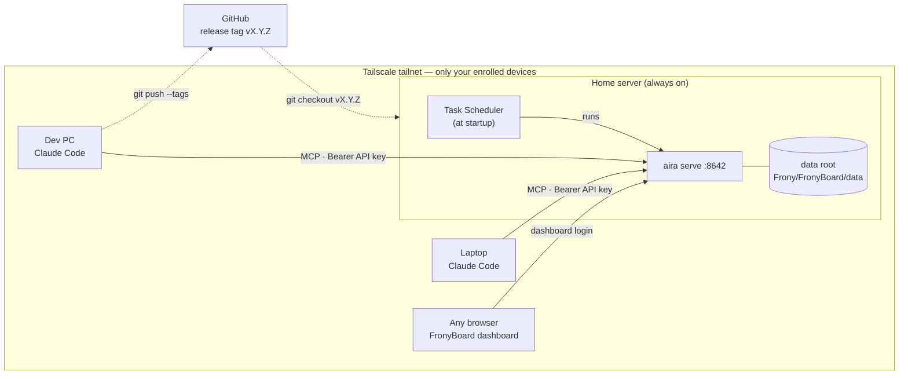

# FronyBoard

An MCP server that gives AI agents (Claude Code and friends) a first-class project
tracker.

Where Jira is an issue tracker for humans behind a web UI, FronyBoard replaces each
part with something an agent can use natively:

| Jira | FronyBoard |
|---|---|
| Database | Plain files in a dedicated data directory |
| Records | YAML / Markdown |
| API | MCP tools |
| Workflow engine | Schema + rule validation, run as a gate before every write |
| State transition | An MCP tool call (`transition_task`) |

The schema and operating rules were extracted from a real product's management system
(31 tasks shipped through it), then generalized.

## Install

Requires [uv](https://docs.astral.sh/uv/).

```powershell
git clone https://github.com/Cafelatte1/project-aira
cd project-aira/backend
uv sync
```

The repo is a monorepo: `backend/` holds the MCP server (a uv project), `frontend/`
the FronyBoard web dashboard. Commands below run from `backend/`.

Data lives under `%LOCALAPPDATA%\Frony\FronyBoard\data` by default
(`~/.Frony/FronyBoard/data` where `LOCALAPPDATA` is unset); set `AIRA_DATA_DIR`
to relocate it. Logs (JSON Lines, one line per MCP tool call plus server events) go
to the sibling `logs` folder — `AIRA_LOG_DIR` overrides; see [docs/logging.md](docs/logging.md).

## Run

### Remote (home server)

FronyBoard is designed to run on one always-on machine, with every client PC talking
to it over MCP streamable HTTP. Issue one API key per client machine, then start
the server:

```powershell
uv run aira keygen pc1        # prints the key once — store it on that PC
uv run aira serve             # binds 0.0.0.0:8642, requires a valid key on every request
```

Register on each client (any project, or `--scope user` for everywhere):

```powershell
claude mcp add --transport http FronyBoard http://<server>:8642/mcp --header "Authorization: Bearer <api key>"
```

Or let `scripts\configure_mcp_settings.ps1 -ApiKey <api key>` register the server as
`FronyBoard` in every client installed on that PC — Claude Code, Codex CLI and
Claude Desktop — and re-run it later to rotate the key (no argument reuses the
configured one).

Keys are stored hash-only in the Frony-wide registry
`%LOCALAPPDATA%\Frony\auth.yaml` (`FRONY_AUTH_FILE` overrides) — one key per
device, shared by every Frony service on that machine; revoke one by deleting its
entry. For access across networks (e.g. a laptop at a cafe), put the server and
clients on a [Tailscale](https://tailscale.com/) tailnet and use the server's
Tailscale name as `<server>` — only your enrolled devices can reach it, from
anywhere.

### Hosted clients (Claude / ChatGPT apps)

The Claude and ChatGPT apps connect from the vendor's servers, not from your
device, so they need a public HTTPS address and log in with OAuth instead of a
static key. Expose `/mcp` (and the OAuth paths) with
[Tailscale Funnel](https://tailscale.com/kb/1223/funnel) and start the server
with that address:

```powershell
$env:AIRA_PUBLIC_URL = "https://<machine>.<tailnet>.ts.net"   # or: aira serve --public-url …
$env:AIRA_PUBLIC_MCP_PATH = "/board/mcp"                       # the Funnel path that proxies to /mcp
uv run aira serve
```

Add `https://<machine>.<tailnet>.ts.net/board/mcp` as a custom connector in the app;
the approval page asks for the dashboard login (`aira admin`). Access tokens
last 24 hours and refresh silently for 90 days; API keys keep working unchanged.
See [docs/operations.md](docs/operations.md) for the Funnel paths. Tokens live in
the Frony-wide `%LOCALAPPDATA%\Frony\oauth.yaml`, so other Frony services on
the same machine can accept them on their own Funnel path without running OAuth
themselves — [docs/auth.md](docs/auth.md#other-frony-services-behind-the-same-login).

### Local (stdio)

```powershell
claude mcp add FronyBoard -- uv run --directory <path-to-project-aira>\backend aira
```

## FronyBoard — the dashboard

FronyBoard is the human-facing, read-only view of the same data: yearly overview,
quarterly/monthly milestones, per-month progress, and the task table — click a
task row for its full record (content as markdown, branch, timestamps). The server
serves it at `http://<server>:8642/` — sign in with the dashboard login, set once
on the server with `aira admin <username>` (all writes still go through the MCP
tools; API keys stay agent-only). Sessions live in server memory, so a server
restart signs viewers out. The Settings screen can issue and revoke API keys —
those endpoints require the dashboard login, never an API key; the first key
still comes from `aira keygen`, since `serve` refuses to start without one.

The dashboard source lives in `frontend/` (React + Vite). Its build output
(`frontend/dist`) is committed to the repo on purpose, so the home server needs
no Node toolchain — `git pull` is enough. After changing the frontend:

```powershell
cd frontend
npm install
npm run build     # refresh frontend/dist, then commit it
```

`npm run dev` starts a dev server that proxies `/api` to a locally running
`aira serve` (override with `AIRA_API=http://<server>:8642`).

## Project setup

Connecting the MCP server gives every session the tools and the general workflow
(delivered as server instructions). What it cannot know is **which FronyBoard project
a codebase belongs to** — declare that in the codebase itself by adding this section
to its `CLAUDE.md` (create the file if the project has none):

```markdown
## FronyBoard

This project is tracked by FronyBoard (project key: DLY).
Manage tasks through the FronyBoard MCP tools, following the FronyBoard server instructions.
```

Replace `DLY` with the project's key (register one first with `create_project`).
The section is also the opt-in signal: a codebase without it is treated as not
FronyBoard-managed.

## Deploy — Windows home server

The server machine only deploys; development happens on client PCs and flows
through git (`push` on a dev PC → `pull` + restart here).



One always-on machine runs the server and owns the data; every other device is
a client — Claude Code sessions talk MCP with an API key, humans open the
dashboard in a browser. Code reaches the server only as release tags pulled
from GitHub, never by editing in place.

1. Install [Tailscale](https://tailscale.com/download), log in with the same
   account as your client PCs, and enable **Settings → Run unattended** so the
   tailnet stays up with nobody logged in. In the
   [admin console](https://login.tailscale.com/admin/machines), disable key
   expiry for this machine.
2. Install the server — the home server runs **release tags only**, never the tip
   of main:

   ```powershell
   git clone https://github.com/Cafelatte1/project-aira
   cd project-aira
   git checkout vX.Y.Z                   # the latest release tag
   cd backend
   uv sync
   uv run aira keygen <client-pc-name>   # once per client PC, save each key
   uv run aira admin <username>          # dashboard login (prompts for a password)
   ```

3. Keep it running across reboots with Task Scheduler (`taskschd.msc` → Create
   Task): trigger **At startup**, action = path from `(Get-Command uv).Source`
   with arguments `run --directory <path-to-project-aira>\backend aira serve`, and check
   **Run whether user is logged on or not**. If the task runs as SYSTEM, its
   `%LOCALAPPDATA%` points into the system profile — set `AIRA_DATA_DIR` to the
   intended absolute path (e.g.
   `C:\Users\<user>\AppData\Local\Frony\FronyBoard\data`), for instance in a
   small launcher `.cmd` the task runs instead. Set `AIRA_TZ=Asia/Seoul` there
   too — the dashboard shows timestamps in the server's zone, and Windows cannot
   name its own zone otherwise.
4. To update: cut a release on a dev PC (`git tag -a vX.Y.Z && git push --tags`),
   then on the server run `powershell -NoProfile -File scripts\deploy.ps1 -Tag vX.Y.Z`
   — it stops the task (`uv sync` cannot replace a running `aira.exe`), checks
   out the tag, syncs, and starts the task again. Without `-Tag` it only
   restarts the server. See [docs/operations.md](docs/operations.md).

Clients then connect with the server's Tailscale name (see "Remote" above).

## Model

```
projects/
└── {KEY}/                  one folder per project, named by its key (e.g. DLY)
    ├── roadmap.yaml        yearly overview (goal / now / next / later) + quarterly milestones
    └── {YYYY}{Q#}.yaml     one file per opened period (e.g. 2026Q3.yaml):
                            monthly milestones (M1, M2, ...) + tasks ({KEY}-001, ...)
                            + `result` (retrospective, written when the period closes)
```

A project is two kinds of files — the roadmap, and one file per period.

- **Task ids are a project-global sequence** (`DLY-042`) — they keep counting across
  periods and are never reused. They are the only link between FronyBoard and a codebase:
  use them in branch names (`feat/DLY-042/short-desc`) and record the branch on the task.
- **Reference chain**: `task.month → months[].id`, `period file → roadmap milestone`.
  Rollups follow this chain — months are the grouping unit.
- **Statuses** — milestones and months: `planned | active | done`;
  tasks: `todo | in_progress | done | blocked | cancelled`.
- **`cancelled` is the soft delete** — there is no hard delete. Cancelling requires a
  reason, keeps the record (and its id) forever, and hides the task from queries by
  default (`list_tasks` takes `include_cancelled`). `blocked` = may resume,
  `cancelled` = will not happen; transitioning a cancelled task restores it.
- **Carry-over**: a task that outlives its period is not moved — recreate it in the next
  period under a new id and note the mapping in the closing retrospective.
- **Timestamps** (`meta.created_at` / `updated_at` / `started_at` / `completed_at`) are
  stamped by the server in naive UTC — `started_at` on the first `in_progress` transition,
  `completed_at` on `done` (and removed again if the task leaves `done`). Agents never
  write them.
- **The `result` field closes a period** — the rest of the file holds only current
  state, so the "why it turned out this way" lives there: judgment and reasons,
  not counts. Its presence is what marks a period closed.

## Tools

| Area | Tools |
|---|---|
| Projects | `create_project`, `update_project`, `list_projects`, `get_roadmap`, `get_status`, `validate` |
| Roadmap | `set_overview`, `upsert_milestone` |
| Periods | `open_period`, `close_period`, `get_retrospective` |
| Planning | `upsert_month`, `create_task`, `update_task`, `transition_task` |
| Queries | `list_tasks` |

`update_task` and `transition_task` derive the project from the task id prefix
(`DLY-042` → `DLY`), so their `key` parameter is optional. Re-calling
`close_period` on a closed period rewrites its retrospective.

Typical flow:

```
create_project → set_overview → upsert_milestone → open_period
→ upsert_month / create_task
→ transition_task in_progress (with branch) → ... → transition_task done
→ close_period (retrospective)
```

Every mutation is validated before anything is written; invalid changes are rejected
with the full error list. `close_period` refuses while tasks are still `todo` or
`in_progress`. Writes are serialized per project, so concurrent clients cannot
collide on ids or lose updates.

## Development

```powershell
uv run --directory backend pytest
```

Layout: `backend/src/aira/` — `store.py` (file IO, data root), `validation.py`
(schema gate), `service.py` (operations), `auth.py` (API keys, sessions, bearer
middleware), `oauth.py` + `oauth_pages.py` (OAuth for hosted apps, approval
page), `web.py` (JSON API + static serving), `server.py` (MCP tool
surface + CLI); `frontend/` — the FronyBoard dashboard, built to static files
served by the backend.

More docs under [docs/](docs/):

- [docs/auth.md](docs/auth.md) — access channels (CLI agents, desktop, dashboard, hosted apps) and how each authenticates
- [docs/http-api.md](docs/http-api.md) — the FronyBoard JSON API
- [docs/data-model.md](docs/data-model.md) — field-level schema and validation rules
- [docs/operations.md](docs/operations.md) — home server runbook
