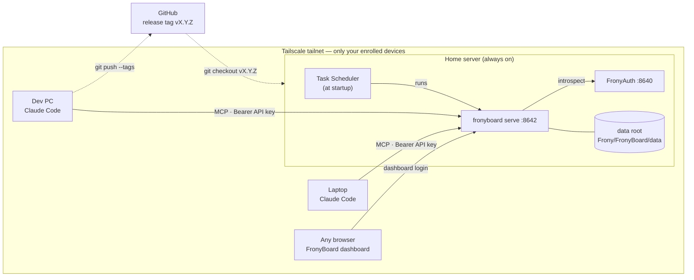

# Self-hosting — one server, many clients

**When to read**: when running FronyBoard as a shared HTTP server for several machines or for the hosted Claude / ChatGPT apps, instead of the local stdio install in the README
**Code**: `backend/src/fronyboard/web.py`, `backend/src/fronyboard/fauth.py`, `scripts/`
**Related**: [operations](operations.md) (day-2 runbook)

---

The README's install runs FronyBoard as a child process of one MCP client, with no
network at all. This page is the other mode: `fronyboard serve` on one always-on
machine, every other device a client. Nothing here is needed for the stdio install.

## What `serve` adds

- **MCP over streamable HTTP** on `:8642` (`/mcp`), so several machines share one
  board. Every request carries a bearer token: an API key per device, or an OAuth
  access token for hosted apps.
- **The dashboard** at `http://<server>:8642/` — the human-facing, read-only view of
  the same data (yearly overview, milestones, per-month progress, the task table;
  click a row for the full record). It signs in with a dashboard login; writes still
  go only through the MCP tools.
- **Authentication delegated to FronyAuth** — a separate service
  ([project-auth](https://github.com/Cafelatte1/project-auth)) that issues API keys and
  the dashboard login for every Frony service and verifies each token through
  introspection. `serve` needs `FRONY_AUTH_URL` (default `http://127.0.0.1:8640`) and
  its own key in `FRONY_SERVICE_KEY`; without a reachable FronyAuth every request
  answers 503. Every credential — API keys, the dashboard login, OAuth clients and
  tokens — belongs to FronyAuth; FronyBoard never judges one itself.
- **Local mode** — `fronyboard serve --local` skips all of the above: loopback only, no
  FronyAuth, no credentials, the dashboard opens without a login. One person, one machine;
  when a second device should see the board, run the normal mode.



One machine runs the server and owns the data; code reaches it only as release
tags pulled from GitHub, never by editing in place. For access from outside the
LAN (a laptop at a cafe), put the server and clients on a
[Tailscale](https://tailscale.com/) tailnet and use the server's Tailscale name
as `<server>` — only your enrolled devices can reach it, from anywhere.

## Server setup (Windows)

1. Install [Tailscale](https://tailscale.com/download), log in with the same
   account as your client PCs, and enable **Settings → Run unattended** so the
   tailnet stays up with nobody logged in. In the admin console, disable key
   expiry for this machine.
2. Install the server — a release tag, never the tip of main:

   ```powershell
   git clone https://github.com/Cafelatte1/fronyboard
   cd fronyboard
   git checkout vX.Y.Z                   # the latest release tag
   cd backend
   uv sync
   ```

   Install FronyAuth next to it the same way (`git checkout vX.Y.Z`, `uv sync` in
   its checkout), then issue keys and the dashboard login there:

   ```powershell
   uv run fauth keygen <client-pc-name>  # once per client PC — the key prints once, save it
   uv run fauth keygen FronyBoard        # the server's own key -> FRONY_SERVICE_KEY
   uv run fauth admin <username>         # dashboard login (prompts for a password)
   ```

   A fresh machine bootstraps ssh, git and uv with `scripts\bootstrap-server.ps1`
   (run once, as admin).
3. Keep it running across reboots: copy `scripts\fronyboard-server.cmd.example` to
   `C:\Users\<user>\fronyboard-server.cmd`, fill in `FRONY_SERVICE_KEY`, then run
   `scripts\register-task.ps1` from an elevated PowerShell. It creates the
   "FronyBoard Server" task (at startup, as SYSTEM) that runs the launcher. The
   launcher pins `AIRA_DATA_DIR` because SYSTEM's `%LOCALAPPDATA%` is the system
   profile, and sets `FRONYBOARD_TZ` so the dashboard shows the server's zone.
   [operations](operations.md), First-time setup, has the details.
4. To update: cut a release on a dev PC (`git tag -a vX.Y.Z; git push --tags`), then
   on the server run `powershell -NoProfile -File scripts\deploy.ps1 -Tag vX.Y.Z` — it
   stops the task (`uv sync` cannot replace a running `fronyboard.exe`), checks out
   the tag, syncs, and starts the task again. Without `-Tag` it only restarts.

Every env var the server reads lives in the launcher and nowhere else:
`AIRA_DATA_DIR`, `FRONYBOARD_TZ`, `FRONYBOARD_LOG_DIR`, `FRONY_AUTH_URL`,
`FRONY_SERVICE_KEY`, and for hosted apps `FRONYBOARD_PUBLIC_URL` /
`FRONYBOARD_PUBLIC_MCP_PATH`.

## Clients

Register the server in Claude Code on each client PC with the key issued for that
machine (any project, or `--scope user` for everywhere):

```powershell
claude mcp add --transport http FronyBoard http://<server>:8642/mcp --header "Authorization: Bearer <api key>"
```

Or let `scripts\configure_mcp_settings.ps1 -Server http://<server>:8642 -ApiKey <api key>`
register the server as `FronyBoard` in every client installed on that PC — Claude
Code, Codex CLI and Claude Desktop — and re-run it later to rotate the key (no
`-ApiKey` reuses the configured one).

Keys are stored hashed in FronyAuth's registry, one key per device shared by every
Frony service on that machine; revoke one from the dashboard's Settings screen or
with `fauth`. Key management always needs the dashboard login — an API key cannot
issue or revoke keys.

## Hosted clients (Claude / ChatGPT apps)

The Claude and ChatGPT apps connect from the vendor's servers, not from your
device, so they need a public HTTPS address and log in with OAuth instead of a
static key. Expose the MCP path (and FronyAuth's OAuth paths) with
[Tailscale Funnel](https://tailscale.com/kb/1223/funnel) and start the server
with that address:

```powershell
$env:FRONYBOARD_PUBLIC_URL = "https://<machine>.<tailnet>.ts.net"   # or: fronyboard serve --public-url …
$env:FRONYBOARD_PUBLIC_MCP_PATH = "/board/mcp"                       # the Funnel path that proxies to /mcp
uv run fronyboard serve
```

Add `https://<machine>.<tailnet>.ts.net/board/mcp` as a custom connector in the app;
the approval page asks for the dashboard login. Access tokens last 24 hours and
refresh silently for 90 days; API keys keep working unchanged. The Funnel path
layout and the OAuth flow are in [operations](operations.md), "Hosted MCP clients".

## Dashboard

Served by the same process at `http://<server>:8642/`. Sessions live in server
memory, so a restart signs everyone out. The Settings screen lists, issues and
revokes API keys (dashboard login required).

The dashboard source is `frontend/` (React + Vite); its build output
`frontend/dist` is committed on purpose, so the server needs no Node toolchain —
`git pull` is enough. After changing the frontend:

```powershell
cd frontend
npm install
npm run build     # refresh frontend/dist, then commit it
```

`npm run dev` starts a dev server that proxies `/api` to a locally running
`fronyboard serve` (override the target with `AIRA_API=http://<server>:8642`).
